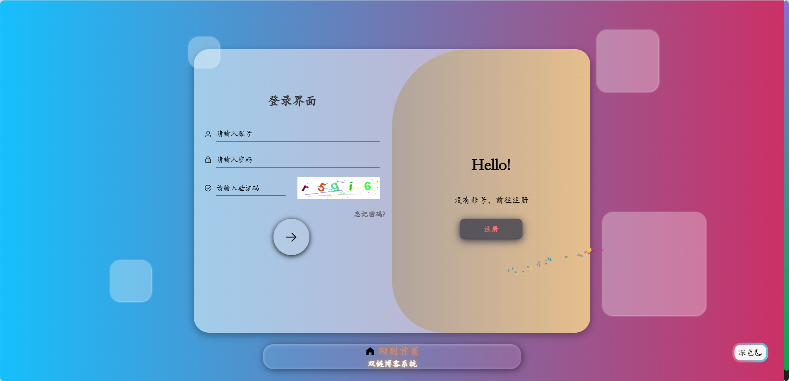
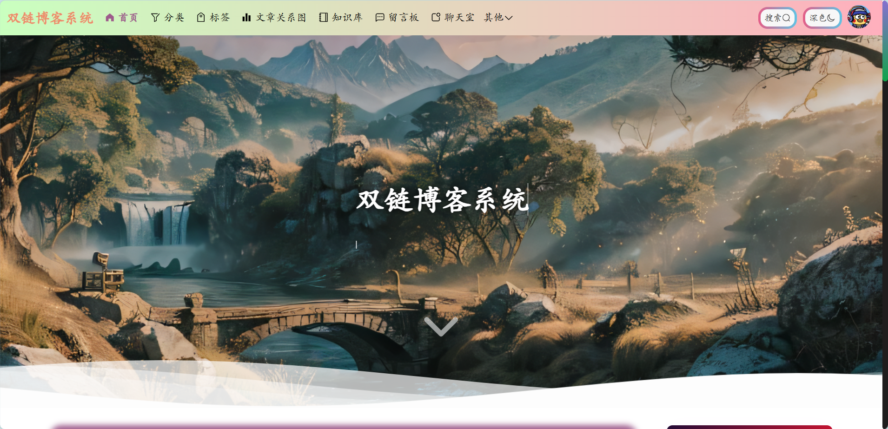
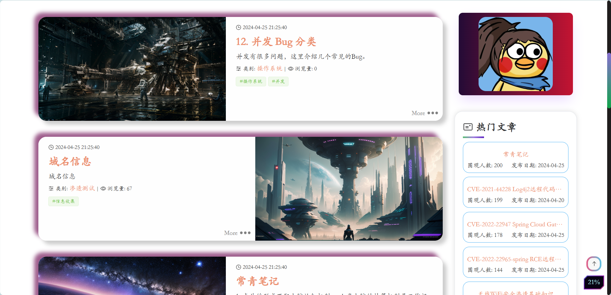
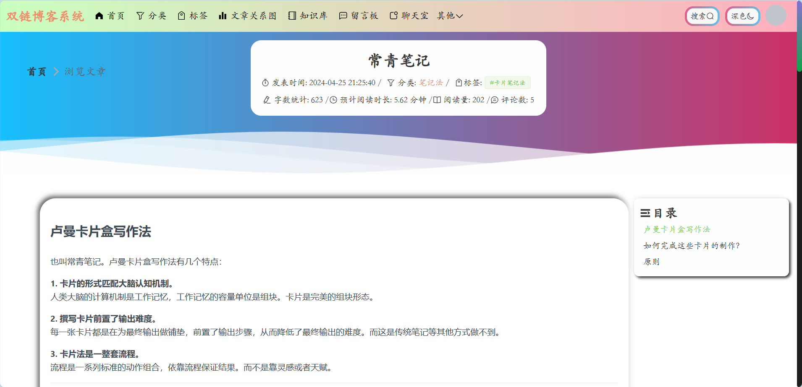
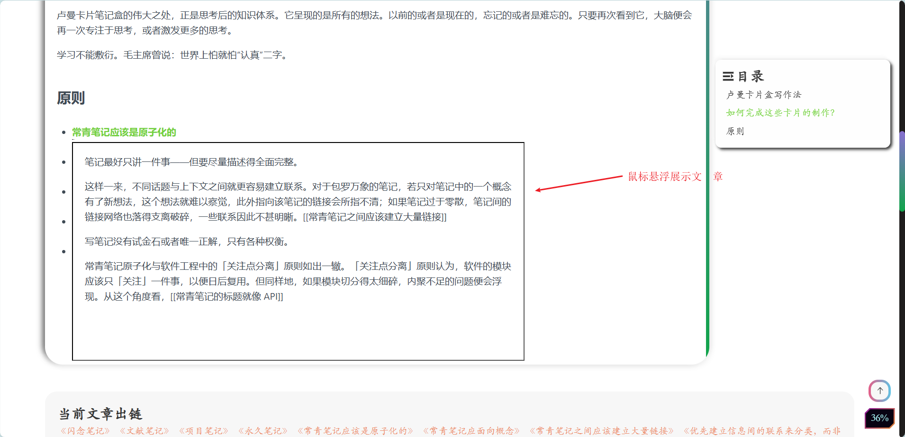
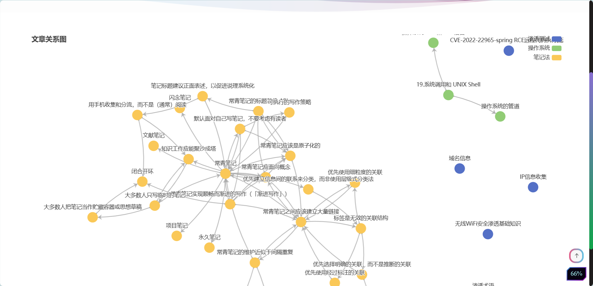
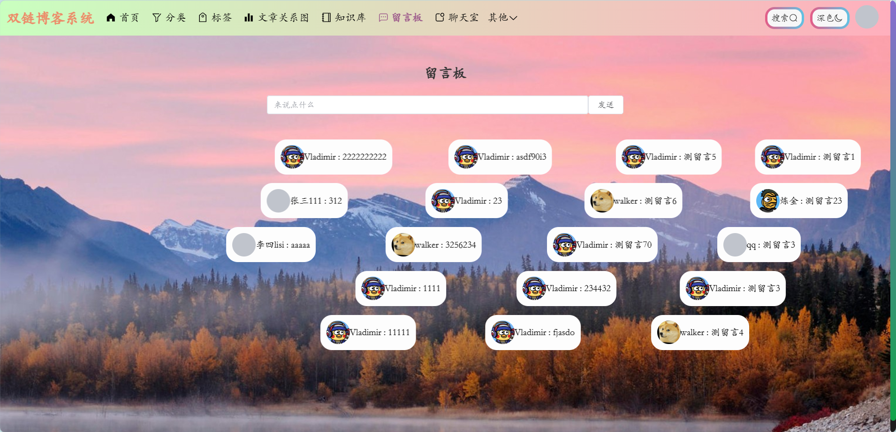
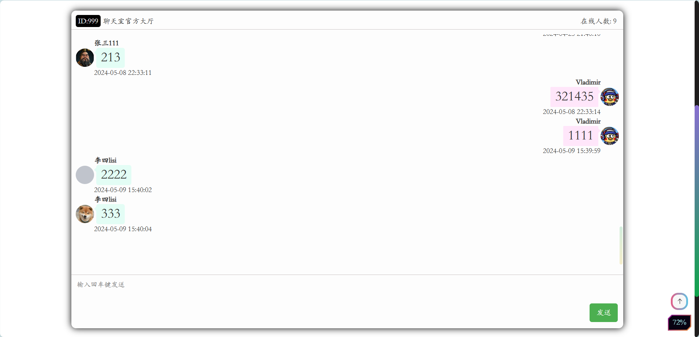
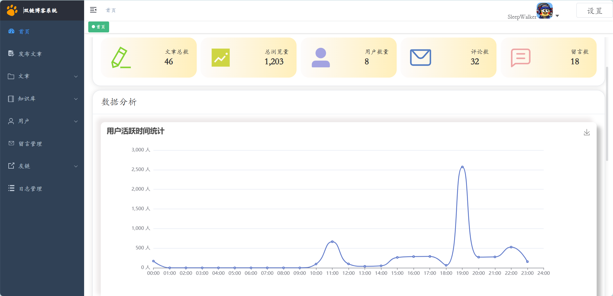
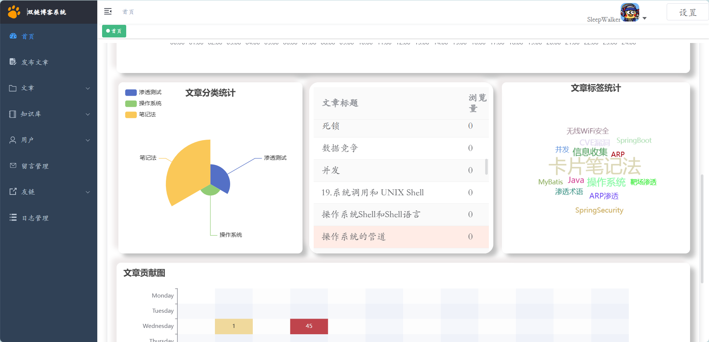

# 项目介绍

## 目录结构

- server目录下为后端（服务端）。

- web目录下为前端。

## 项目特点

- **双向链接**：通过双向链接将文章连接成一个关系图，点击图中的节点可以进行跳转。

- **搜索和标签功能：** 用户可以通过关键词搜索文章，并且可以根据分类、标签浏览相关文章。

- **评论和回复功能：** 用户可以在文章下方发表评论，并可以回复其他用户的评论。

- **留言功能：** 用户可以在页面上看到其他用户的留言弹幕，也可以自己发送留言，鼠标悬浮在弹幕上停止移动。

- **工具箱**：多线程 IP 扫描和端口扫描。

## 技术介绍

- 后端：SpringBoot、SpringSecurity、JWT、MySQL、Redis。

- 前端：Vue3、ElementPlus、Pinia、Echarts、Axios。

## 项目展示

### 前台

### 后台

